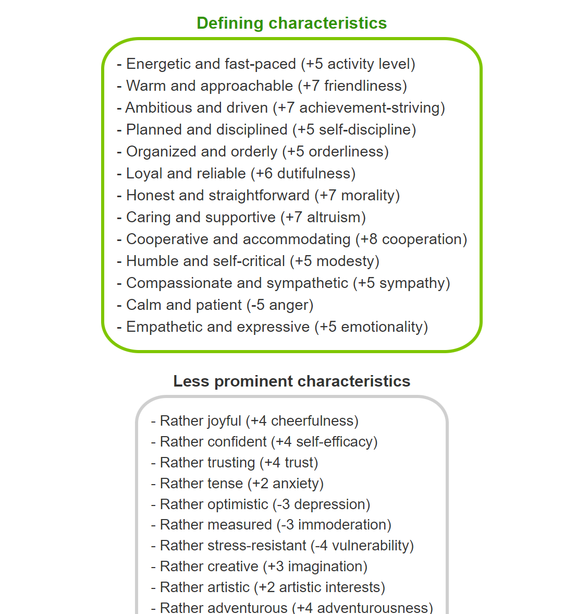

# Big Five - Describe Me!
This application interprets results from the widely recognized [Big Five personality test model](https://bigfive-test.com/) to describe the key defining characteristics of a person in the form of easy to understand adjectives. 

It categorizes individuals across five key traits—Conscientiousness, Agreeableness, Extraversion, Neuroticism, and Openness to Experience— and 30 sub traits, summarizing the atypical traits that distinguishes the person from the population averages. 

As a fun addition, individuals are also aligned with RPG roles and [ethical and moral alignment axes in D&D](https://en.wikipedia.org/wiki/Alignment_(Dungeons_%26_Dragons)). 

To access: https://serhan-yilmaz.shinyapps.io/bigfive-describe-me

 
